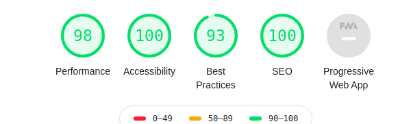

# SpaceX
A React server side rendering application which would help users list and browse all launches by SpaceX program with some filters for the years of launches.
[Demo](https://spacex-launch-2020.herokuapp.com/) of this repo.

## Prerequisties

[NodeJS](https://nodejs.org/en/)

## Build and Run

Install node packages required for this project

```bash
$ yarn
```
To start the app on http://localhost:3000

```bash
$ yarn start
```

## Run Test Cases

Install node packages required for this project

```bash
$ yarn test
```

## Deployment

Integrate CI/CD setup to automatically deploy on heroku over master branch.
Used [CircleCi](https://circleci.com/) for automatic deployments and [CodeClimate](https://codeclimate.com/) for the test coverage and code quality.

## Lighthouse Score
